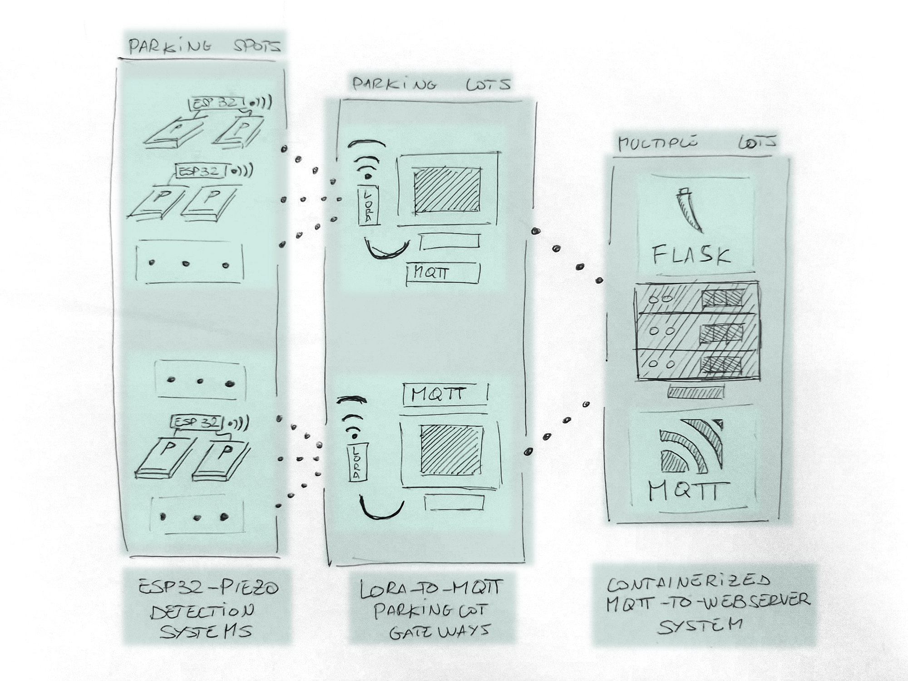
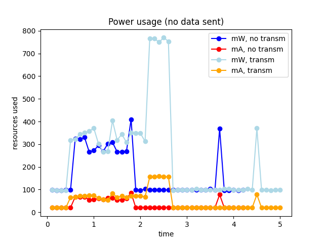

# i(L)ot - IoT Algorithms and Services Sapienza 23/24

The following repository contains the final group project for the 23/34 edition
of the IoT Algorithms and Services course held in Sapienza University of Rome.

The repository contains code for a smart IoT parking system that relies on embedded devices to collect data on parking spots availability.
The code is separated between the core esp32 component (iLot), that can provide information about the occupancy of two different parking spots via two connected piezoelectric devices;
a gateway component that relies on a Cubecell IoT device to act as a "LoRa antenna" for a beefier MQTT gateway device,
and a containerized server component that receives MQTT data to be processed in a easily accessible and persistent format.

## Architecture


The system relies on a tiered architecture, with different protocols employed at each level. From the bottom up:
- The lowermost layer of the architecture is the ESP32 - Detector component. This communicates with the upper level via the LoRa protocol, chosen since the working of the ESP32 component would require constant, sleep-heavy duty cycling; LoRa allows the devices to communicate without having to setup and negotiate a connection every wakeup, lowering energy costs significantly. Attention was given to avoiding MitM attacks at this level. Each device at this level accounts for 2 parking spots in a lot, sending a message every time it's woken up by a detection in either of the spots.
  
- The middle layer acts as a bridge between the server and the devices, as communicating over LoRa directly to the server wouldn't work. The devices in this layer consist of regular machines, connected to the internet, with a prototyping board (we used a cubecell, but any LoRa and serial capable device can work) connected to act as a LoRa antenna. The system receives the messages and resends them via MQTT to a broker present on the next layer. MQTT was chosen to allow, if needed, to send messages back to the lower layers of the system, but this capability went unused. Every device on this layer accounts for a multitude of parking spots, intended for potentially handling the messages of the entire parking lot building.
  
- The uppermost layer is a dockerized system composed by an MQTT broker and a webserver. The broker sends data to the webserver, that subscribes to the required MQTT topic. Every received message updates the webserver state, which can be accessed via a web interface. Every element on this layer is meant to take care of 1..n parking lots.
  
## How to setup
Clone the repo, then:

### ESP32
The ESP component requires the Espressif SDK. For the automated wakeup to work correctly,
two GPIO pins must be selected (defaults to GPIO1 and GPIO2) as wakeup sources, either via menuconfig or by editing sdkconfig directly,
and the piezoelectric devices analog output connected to these same pins. To get the code running on the device:
```
idf.py set-target <esp32 platform> && idf.py -p /dev/ttyUSB<port_num> flash monitor
```
### Gateway
Flash the .ino file to the Cubecell device; Connect the device via USB, and, after adding the MQTT broker password and username pair, run the provided .py file.

### Server
The "Server" component relies on Docker Compose to quickly setup an MQTT "listener" Mosquitto container and a companion Python Flask webserver that
presents the MQTT data in a more convenient format. To first start the containers, simply run:
```
docker-compose up --build
```
while the Docker daemon is running. Depending on the configuration of the Docker instance, administrator priviledges might be required.
The Mosquitto container requires some additional setup, as it needs a non-default password and username pair. To add one, get the Mosquitto container id via
```
docker ps
```
then access the container via sh:
```
docker exec <mosquitto-container-id> -it sh
```
and add a new password with the following command:
```
mosquitto_passwd /mosquitto/config/passwd <username>
```
which will prompt for the new password to be added. Configure these credentials on the Flask server and restart the containers to complete the configuration process.

## Objectives and Rationale
### ESP32
The "heart" of the application, for the ESP32 Detector system the main concern was providing reliable detection of parked cars while minimizing energy consumption. Ideally, we wanted to find a solution we could use a wakeup source and, ideally, as a source of energy harvesting. While the energy harvesting proved to be not worth the effort compared to buying already made solar harvesters and similiar solutions, we did obtain satisfactory results for wakeup sources.
#### Detection
Three different detection systems were considered: a soundwave distance detector, a solenoid element, similiar to the ones that control traffic lights, and piezolectric devices.
- The soundwave distance detector worked out of the box with no modifications needed for our use case, with a maximum range of 4 meters and reliability as long as it was pointed towards a flat surface. The idea ended up being abandoned early as, other than being slightly uninteresting, it would prove to be somewhat unreliable with a car underneath, vulnerable to tampering, and, critically, the fact that unlike the chosen solution, it required to be fed power to work.
  
- The solenoid element was the second route we considered. By placing a solenoid under a moving car, we could've (ideally) obtained an induced current on the solenoid, which we could then use as a wakeup source for the device. This idea was discarded during testing for multiple reasons: it required a suitable solenoid to be built, as no ready units exist, which proved to be a challenge, both due to the amount of required wire and general difficulties in the construction; it required the "activator" car to move over the solenoid at a decent speed, which is hardly ideal in a parking solution; and finally, real traffic units work by being fed AC current at a certain frequency. They then sense cars (or bycicles, sometimes) by noticing shifts in the frequency caused by induction from the moving metal over them. We couldn't easily feed it constant AC current, and, together with other solutions proving to be more appealing, it was scrapped.
  
- The piezoelectric element was the chosen solution. The small sensor chosen is a ready-made device that utilizes a piezoelectric element paired to a protection board that reduces to voltage to a safe range. It provides analog and tuneable digital outputs, the latter requiring external power to work. Once the piezoelectric element is struck by any kind of force that's capable of inducing a vibration, AC current is produced on the analog output, with no external power source required. We connect the AO to the ESP32 device via GPIO pins, which we then setup as EXT1, wake-up-when-any-high GPIO pins. We can pinpoint which one of multiple elements woke up the device, allowing us to connect multiple lot sensors to a single ESP32 for cost effectiveness. To prove the concept, we ended up pairing two sensors to the ESP32.

A wrong sensor, a pressure sensitive resistence, was also bought, but ended up unused due to requiring, again, extra power.

#### Energy consumption
Particular care was put towards making the power consumption as low as possible. During the individual project it was noticed that most of the power consumption came from opening encrypted connections: since we wanted to rely on duty cycling to further reduce power consumption, we couldn't afford to re-estabilish a connection for every wakeup; getting rid of that estabilishing phase would've meant a significant increase in battery life.
To achieve this, we started looking into alternative to regular protocols that wouldn't require setup: we ended up settling on LoRa. The other candidate was ESPNOW, the Espressif communication protocol; discarded due to being an ESP32 exclusive, and requiring Wi-Fi related peripherals to be powered on at every wakeup.

As mentioned previously, the chosen wakeup sensor doesn't require additional power to work, limiting the power consumption further. The device is meant to spend the vast majority of time in deep sleep: we did not require state to be kept from one wakeup to the other, excluding some small variables to facilitate encryption (more on that later), and the nature of a parking lot would mean that the device would rarely need to send data, allowing significant power savings from this kind of heavy duty cycling. We made sure that the device could afford to simply wake up and send data, cutting out anything that would've required listening.

The layered architecture is especially helpful, as it allows us to use the lightest possible protocols to communicate from devices to gateway, leaving the "heavy lifting" of sending the data to an external server to a less power constrained device (in our demo, a pc).

On a single wakeup cycle, this ends up being the final energy consumption:



Sampled in 10 ms intervals. The transmission of data over LoRa obviously providing the biggest spike in energy usage, with an increase of about 200% from the "regular" operative power usage. During deep sleep, the device appears to draw a suspiciously high 20mA and just under 100 mW, while it should sit vastly under 1mA assuming no other loads are active. During operation, barring the transmission of data, the device averages at 50mA and 300mW. During the short transmission scene, the device peaks at 150mA and slightly under 800mW.

#### Components overview
The ESP32 code is split upon a number of developed libraries:
- **Crypto** acts as a convenient wrapper around a number of functions offered by mbedtls, the cryptography library offered by default on the ESP32 SDK. It's mostly focused on handling signature handling and base64 encoding, with some helper functions to help create the context beforehand. The signature handling to handle LoRa-level authentication, and the base64 code to provide a way to send messages containing only a subset of characters. B64 messages also tend to be shorter than the plaintext they originated from, which, in a scenario where transmission is particularly costly, is pretty useful.
- **Lora Communication** takes care of sending and receiving data via the LoRa protocol on the serial. Since the lower level communication relies entirely on LoRa, this is essential.
- **Permstorage** provides an handy way to access the ESP32 NVS, to save data between resets. This was used to give the nonce a persistent backup state.
- **Pspot**, confusingly named, provides functions to rapidly setup the device to for EXT1 wakeups from deep sleep. The code receives two configured pins, prepares the needed bitmask accordingly, and then activates the new sleep sources. It also provides information on the wakeup source on wakeups.

#### LoRa and Encryption
One critical issue encountered faced was that LoRa by default doesn't provide a way to authenticate message senders. In this scenario, eavesdropping doesn't matter, so we could've afforded to send messages "in clear", but care had to be taken to avoid intrusion in the network, messages sent by unauthorized users and replay attacks: the latter especially would be incredibly aggravating, as it would effectively flip the actual availability of the parking spot. To get around this, a signing system with predistributed keys was introduced.

The first attempt was done using rsa 2048 bits private keys for the digital signature of the messages sent by the esp devices; this brings an important issue: the message total size to be sent via LoRa: our devices use an SX1262 LoRa antenna which could transmit 256 bytes of data per transmission and only the signature would have occupied all the available size. For solving this problem is introduced the use of Elliptic Curve private keys which reduces the size of the signature to 70/71 bytes of size as well as reduce the costs of power consuming while producing the signature itself.

The message that gets sent over LoRa during a wakeup cycle is the following:
```
base64(MAC):base64(boot_number):base64(cat(MAC,boot_num,message)):base64(signature(cat(MAC,boot_num,message))
```
with message being 0 or 1 depending on which of the two parking sensors connected to the device triggered the wakeup and message creation. The MAC is of course, to identify the sender. The boot_count acts as a nonce: the gateway keeps the last value and refuses messages from a MAC that contain a boot_count that's not the last recorded boot_count + 1; this was done for the purpose of avoiding replay attacks. The boot count value is kept as an RTC data attribute on the devices, but to prevent data loss, they're backed on the NVS at the end of every cycle. The NVS backup is accessed exclusively in case a full device reset turns the RTC data attribute backed boot_count to 0 again; in that case a branch takes care of accessing the NVS to acquire the backup. To ensure that the message has not been falsified, we sign with the device secret key a concatenation of MAC, boot number and message. On delivery, the gateway will verify the signature, propagating the message on MQTT if valid.
The message does contain a significant amount of redundant information, effectively sending the MAC and boot number data twice. This was a consequence of the message function interfaces estabilished early on the project's timeline lacking the necessary fields. As a stopgap solution, without having to restructure the interfaces across two different devices, we opted for this dirty hack that sends all the data that needs to be signature-verified as a message.

#### Wakeup system
The device functionality hinges on the wakeup system: the code loop is executed exactly once every wakeup, from message creation to connection. The sensors detect car movement, the device is woken up, and a message is sent to the upper layers notifying the change in state. To allow for multiple GPIO pins to wake up the device, we choose to utilize EXT1 as a wakeup source.
The system spends most of it's time in deep sleep, with no state being held excluding RTC attributes and NVS. We use RTC attributes to hold a single unsigned integer variable (the aforementioned nonce) and NVS to back it up in a more "persistent" manner. To avoid multiple false positive wakeups being triggered in sequence, the device enters a timer-wakeup light sleep mode after sending the state change message; at this point the device will wait a few seconds (1 second in testing, 30 or more likely ideal in real world scenarios, to give users time to park) then wake up again, disable the timer wakeup, set up its wakeup sources for deep sleep and then initiate deep sleep. It will proceed to sleep until the next wakeup is triggered

### Gateway

The gateway consists in the couple <Cubecell device, pc with Python SDK> allowing to convert the data from LoRa data fed over serial to MQTT data.
### Server

The server consists in the couple <Mosquitto broker, Flask web application> in which the second one has the goal of making available the parking data to all the shareholders which has no technological skills, by simply consulting the web page which displays the current parking state.


## Required Devices
  - one ESP32 device for each couple of parking spots you have.
  - one device with a LoRa antenna for receiving the LoRa messages from the ESP32 devices.
  - one device which reads the previous LoRa device data by serial communication and is connected to internet.
  - a pair of piezo elements fitted with protection circuits

## Members
- [Emanuele Roncioni](https://www.linkedin.com/in/emanuele-roncioni-4b516a303/)
- [Francesco Saverio Sconocchia Pisoni](https://it.linkedin.com/in/francesco-saverio-sconocchia-pisoni-0a0050303)

Click [here]() for our short presentation.
